# Line Follower Robot  

---

## CONTENTS  

| **Chapter No.** | **Name**            |  
|------------------|---------------------|  
| 1                | Introduction        |  
| 2                | Circuit Diagram     |  
| 3                | Components          |  
| 4                | Views               |  
| 5                | Line Follower Code  |  
| 6                | Working Principle   |  
| 7                | Advantages          |  
| 8                | Conclusion          |  
| 9                | Bibliography        |  

---

## LIST OF FIGURES  

| **Figure No.** | **Figure Name**       |  
|-----------------|-----------------------|  
| Fig 1.1         | Circuit Diagram       |  
| Fig 1.2         | Arduino Uno           |  
| Fig 1.3         | IR Sensor             |  
| Fig 1.4         | L298 Motor Driver     |  
| Fig 1.5         | BO Motors             |  
| Fig 1.6         | Rechargeable Battery  |  
| Fig 1.7         | Breadboard            |  
| Fig 1.8         | Switch                |  
| Fig 1.9         | Side View             |  
| Fig 2.0         | Top View              |  
| Fig 2.1         | Front View            |   

---

## Chapter 1: Introduction  

- **Line-following robots**: Autonomous machines that navigate along a predefined path, typically a black line on a white surface.  
- **Arduino Uno**: Acts as the "brain," processing sensor input and controlling motors.  
- **IR Sensors**: Detect the line and provide essential feedback for navigation.  
- **Servo Motor**: Ensures the robot stays aligned with the line by adjusting its direction.  
- **DC Motors**: Drive the robot along the line.  
- **L298N Motor Driver**: Controls the speed and direction of DC motors based on Arduino signals.  
- **Battery**: Powers all components, ensuring consistent functionality.  
- **Breadboard**: Simplifies prototyping by providing easy connection points for components.  

---

## Chapter 2: Circuit Diagram  

- **Figure**:  
  - **Fig 1.1 Circuit Diagram**: Displays connections between the Arduino Uno, IR sensors, L298 motor driver, BO motors, and other components.  

     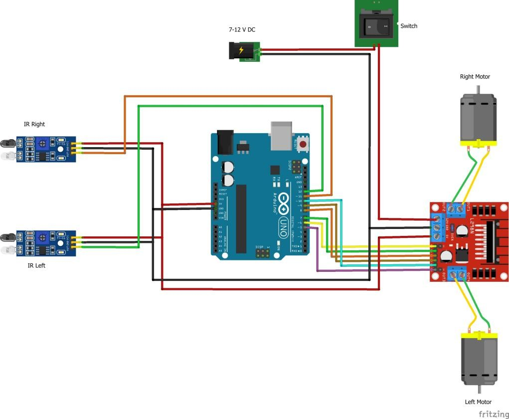 

---

## Chapter 3: Components  

1. **Arduino Uno**  
   - Processes sensor input and generates motor control signals.  

      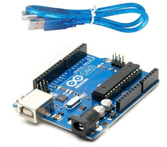  

2. **IR Sensors**  
   - Emit and detect infrared light to differentiate between black and white surfaces.  
   
    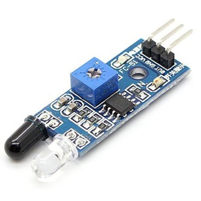

3. **L298N Motor Driver**  
   - Interfaces between the Arduino and DC motors, controlling speed and direction.  
   
    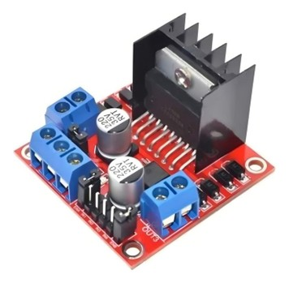

4. **BO Motors**  
   - Provide mechanical motion for the robot’s wheels.  

      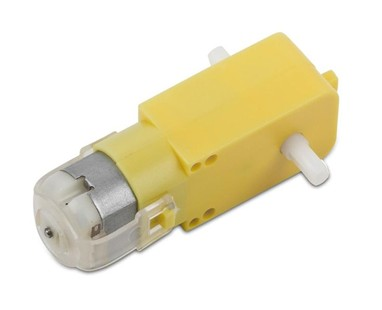

5. **Rechargeable Battery**  
   - Supplies power to all components in the circuit.  

      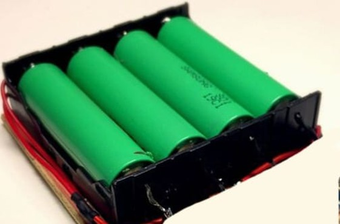  

6. **Breadboard**  
   - Serves as a platform for easy and temporary connections.  

      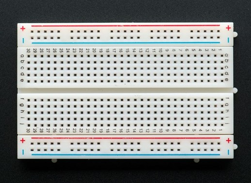  

7. **Switch**  
   - Controls the power supply, enabling the robot to be turned on or off.  
   
     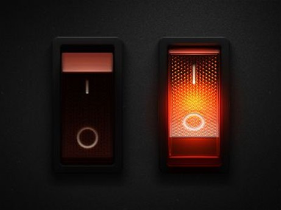

---

## Chapter 4: Views  

- **Fig 1.9 Side View**

  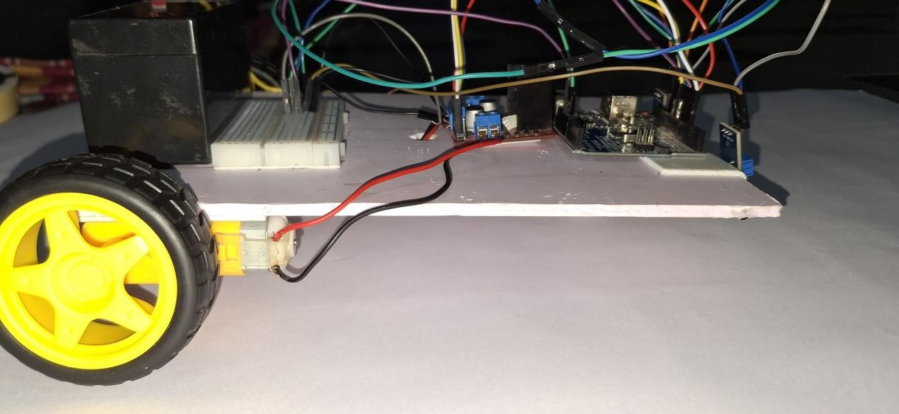
  
- **Fig 2.0 Top View**

  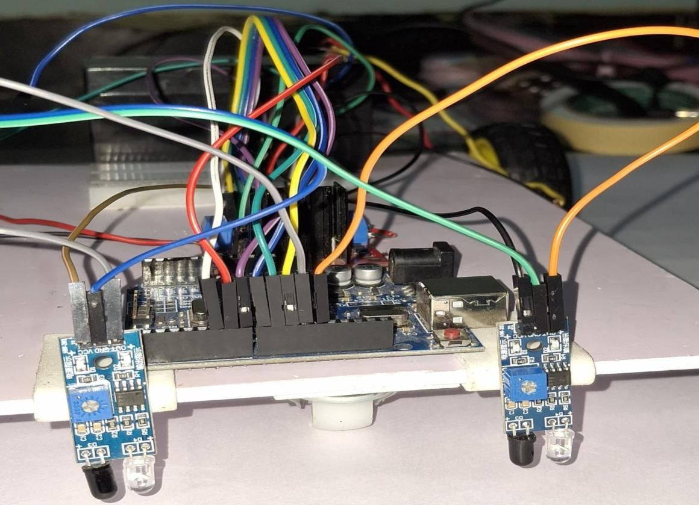
- **Fig 2.1 Front View**

  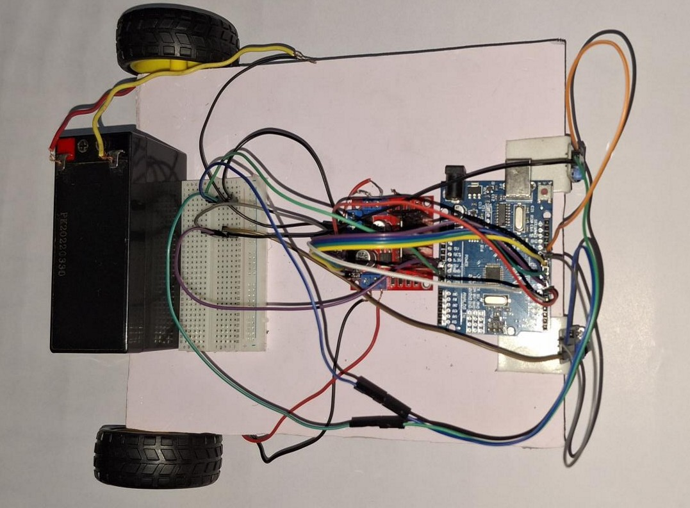

- **Fig 2.2 On The Line**
  
  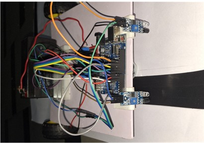

---

## Chapter 6: Working Principle  

- **IR Sensors**: Detect black and white surfaces and send signals to the Arduino.  
- **Arduino Uno**: Processes sensor inputs and determines the appropriate motor actions.  
- **L298 Motor Driver**: Controls motor speed and direction based on Arduino commands.  
- **BO Motors**: Drive the robot forward, turn left, or turn right, depending on the sensor inputs.  

---

## Chapter 7: Advantages  

- **Automation**: Enables precise and autonomous navigation.  
- **Learning Opportunity**: Provides a practical platform for understanding robotics.  
- **Adaptability**: Can be modified for various applications, such as industrial automation or logistics.  

---

## Chapter 8: Conclusion  

- Demonstrates successful integration of components to create a functional autonomous line-following robot.  
- Highlights real-world applications and challenges in robotics and control systems.  

---
